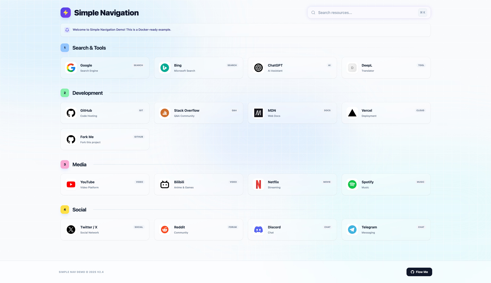

# Simple Navigation

[中文文档](./README_CN.md) | English

A modern, elegant, and highly customizable navigation website built with React and Vite. Features a beautiful liquid glass design with dynamic themes and smooth animations.



## ✨ Features

- 🎨 **Beautiful UI Design** - Liquid glass morphism with gradient backgrounds and smooth animations
- 🎯 **Highly Customizable** - Configure everything via YAML file (title, logo, sections, colors, etc.)
- 🌈 **Dynamic Themes** - Random gradient backgrounds with customizable theme colors per section
- 📱 **Responsive Design** - Works perfectly on desktop, tablet, and mobile devices
- 🐳 **Docker Ready** - Easy deployment with Docker and Docker Compose
- ⚡ **Fast & Lightweight** - Built with Vite for optimal performance
- 🔧 **Easy Configuration** - Simple YAML-based configuration system

## 🚀 Quick Start

### Prerequisites

- Node.js 18+ (or use Docker)
- npm or yarn

### Local Development

1. **Clone the repository**
   ```bash
   git clone https://github.com/AzureFatty/SimpleNav.git
   cd SimpleNav
   ```

2. **Install dependencies**
   ```bash
   npm install
   ```

3. **Start development server**
   ```bash
   npm run dev
   ```

4. **Open your browser**
   Navigate to `http://localhost:5173`

### Docker Deployment

```bash
# Download docker-compose.example.yml and rename it
curl -O https://raw.githubusercontent.com/AzureFatty/SimpleNav/main/docker-compose.example.yml
mv docker-compose.example.yml docker-compose.yml

# Start
docker compose up -d
```

Access at `http://localhost`

**Custom config:** Copy `config.yml` from container, edit it, and restart.

**Custom icons:** Create `custom-icons` folder and restart.

## ⚙️ Configuration

All configurations are managed through `public/assets/conf/config.yml`:

### Basic Settings

```yaml
settings:
  columns: 4                    # Number of columns in grid layout
  title: "Simple Navigation"   # Page title
  footer: "Simple Nav © 2025"  # Footer text
  logo: ""                      # Header logo path (optional)
  favicon: ""                   # Favicon path (optional)
  notification: "Welcome!"      # Notification banner message
  actionButton:
    text: "Flow Me"
    url: "https://github.com/AzureFatty"
    icon: "assets/icons/github.png"
```

### Adding Sections

Each section can have its own theme colors and items:

```yaml
sections:
  - id: "search"
    title: "Search & Tools"
    description: "Daily Essentials"
    themeColor: "bg-blue-300"           # Section number background
    hoverText: "group-hover:text-blue-700"
    hoverBg: "group-hover:bg-blue-100"
    hoverBorder: "group-hover:border-blue-700"
    items:
      - name: "Google"
        logo: "assets/icons/google.png"
        subtitle: "Search Engine"
        tag: "search"
        url: "https://www.google.com"
```

### Adding Icons

Place your icon files in `public/assets/icons/` and reference them in the config:

```yaml
logo: "assets/icons/your-icon.png"
```

Supported formats: PNG, SVG, JPG

## 🎨 Customization

### Theme Colors

The project uses Tailwind CSS. You can customize colors by:

1. Editing `tailwind.config.js` for global theme changes
2. Using Tailwind color classes in `config.yml` for section-specific themes

### Background Gradients

Background themes are randomly selected on page load. Edit `src/App.jsx` to add more themes:

```javascript
const themes = [
  { blob1: '#FFE5E5', blob2: '#E5F3FF', blob3: '#FFF5E5' },
  // Add your custom theme here
];
```

## 📦 Build for Production

```bash
npm run build
```

The built files will be in the `dist/` directory.

## 🛠️ Tech Stack

- **Frontend Framework**: React 18
- **Build Tool**: Vite 5
- **Styling**: Tailwind CSS 3
- **Icons**: Lucide React
- **Config Parser**: js-yaml
- **Web Server**: Caddy (Docker)

## 📁 Project Structure

```
SimpleNav/
├── public/
│   └── assets/
│       ├── conf/
│       │   └── config.yml      # Main configuration file
│       └── icons/              # Icon assets
├── src/
│   ├── App.jsx                 # Main application component
│   ├── App.css                 # Application styles
│   └── main.jsx                # Application entry point
├── Dockerfile                  # Docker build configuration
├── docker-compose.yml          # Docker Compose configuration
├── package.json                # Dependencies and scripts
├── vite.config.js              # Vite configuration
└── tailwind.config.js          # Tailwind CSS configuration
```

## 🤝 Contributing

Contributions are welcome! Please feel free to submit a Pull Request.

1. Fork the repository
2. Create your feature branch (`git checkout -b feature/AmazingFeature`)
3. Commit your changes (`git commit -m 'Add some AmazingFeature'`)
4. Push to the branch (`git push origin feature/AmazingFeature`)
5. Open a Pull Request

## 📝 License

This project is open source and available under the [MIT License](LICENSE).

## 🙏 Acknowledgments

- Icons from various sources (Google, GitHub, etc.)
- Inspired by modern web design trends
- Built with love using React and Vite
- Google Gemini

## 📧 Contact

- GitHub: [@AzureFatty](https://github.com/AzureFatty)
- Project Link: [https://github.com/AzureFatty/SimpleNav](https://github.com/AzureFatty/SimpleNav)

---

⭐ If you find this project useful, please consider giving it a star on GitHub!
